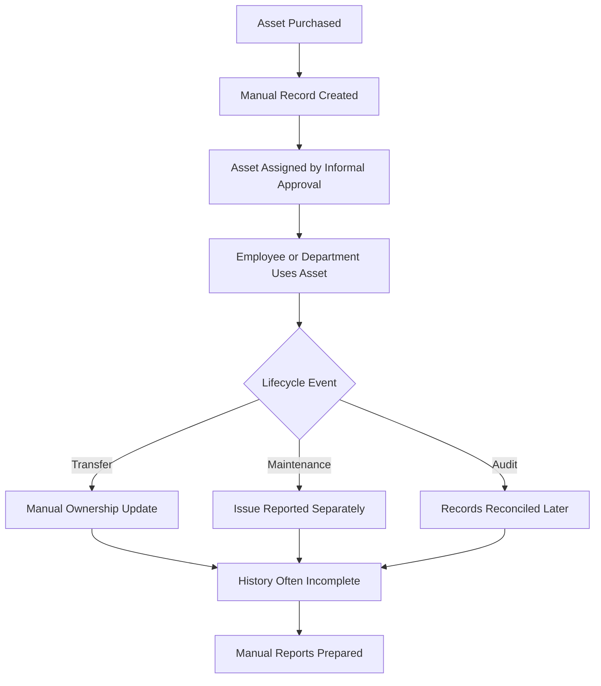

# Problem Statement

## Table of Contents

- [Official Odoo Hackathon Problem Statement](#official-odoo-hackathon-problem-statement)
- [Existing Problem](#existing-problem)
- [Current Workflow](#current-workflow)
- [Pain Points](#pain-points)
- [Why Organizations Need AssetFlow](#why-organizations-need-assetflow)
- [Backend Success Criteria](#backend-success-criteria)

## Official Odoo Hackathon Problem Statement

> Paste the official Odoo Hackathon problem statement here when it is released or finalized by the organizing team.

## Existing Problem

Organizations manage many assets across employees, departments, locations, and operational workflows. Assets may include laptops, monitors, equipment, furniture, vehicles, tools, shared devices, and specialized resources.

Many teams still rely on spreadsheets, emails, chat approvals, manual handover sheets, and disconnected records. As the organization grows, this approach causes stale data, unclear ownership, missing approvals, weak audit trails, and delayed maintenance.

## Current Workflow

## Pain Points

| Pain Point | Operational Impact |
| --- | --- |
| No single source of truth | Teams cannot reliably identify current asset owner, location, or condition. |
| Manual lifecycle updates | Transfers, returns, repairs, and audits can be missed or duplicated. |
| Weak authorization | Approval responsibility is unclear and difficult to enforce. |
| Missing audit trail | Organizations cannot easily prove who changed what and when. |
| Delayed maintenance | Issues may not be prioritized, assigned, or resolved with traceability. |
| Poor availability checks | Shared resources may be double-booked or underused. |
| Limited reporting | Asset utilization, maintenance burden, and inventory health require manual analysis. |

## Why Organizations Need AssetFlow

AssetFlow provides a backend system that standardizes asset lifecycle operations through structured database records, validated API actions, role permissions, and audit logs.

| Need | Backend Capability |
| --- | --- |
| Accurate asset inventory | Central `assets` records with category, status, location, and department. |
| Clear ownership | Allocation records and transfer history. |
| Approval control | Role-based authorization and approval endpoints. |
| Maintenance traceability | Maintenance ticket lifecycle with assignment and resolution data. |
| Audit readiness | Verification records, discrepancies, and append-only audit logs. |
| Resource scheduling | Booking records with conflict validation. |
| Reporting | Queryable normalized data with indexes for common filters. |

## Backend Success Criteria

The backend MVP is successful when:

- Authentication and role authorization are enforced on protected APIs.
- Core database tables are normalized and migrated through Prisma.
- Asset lifecycle workflows preserve current state and history.
- Booking conflict validation prevents invalid reservations.
- Maintenance, audit, and transfer actions create traceable records.
- API responses use consistent status codes and error shapes.
- Database changes are documented, reversible where practical, and testable.
- New backend developers can onboard using this repository documentation.

