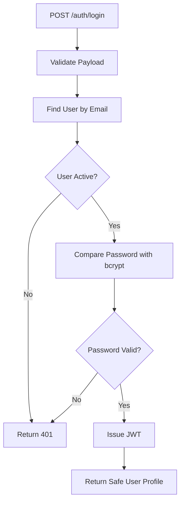
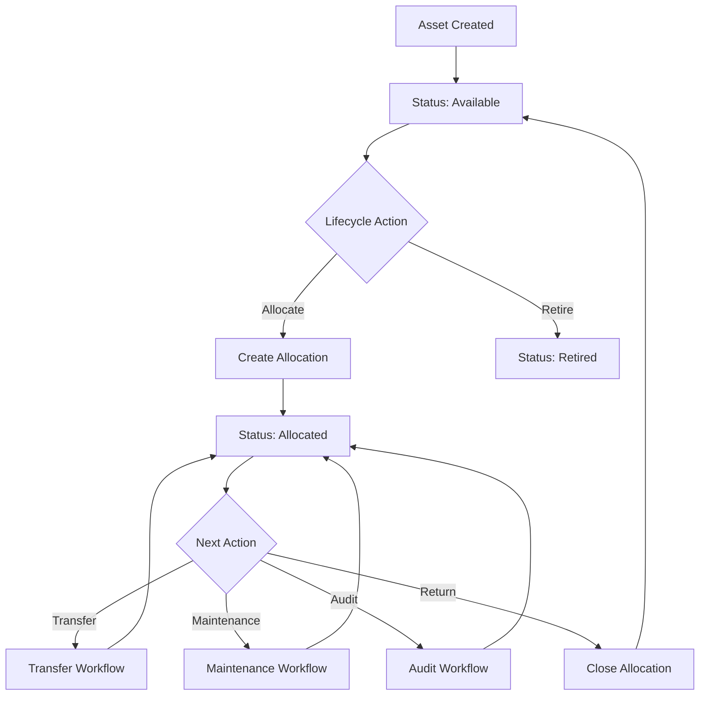
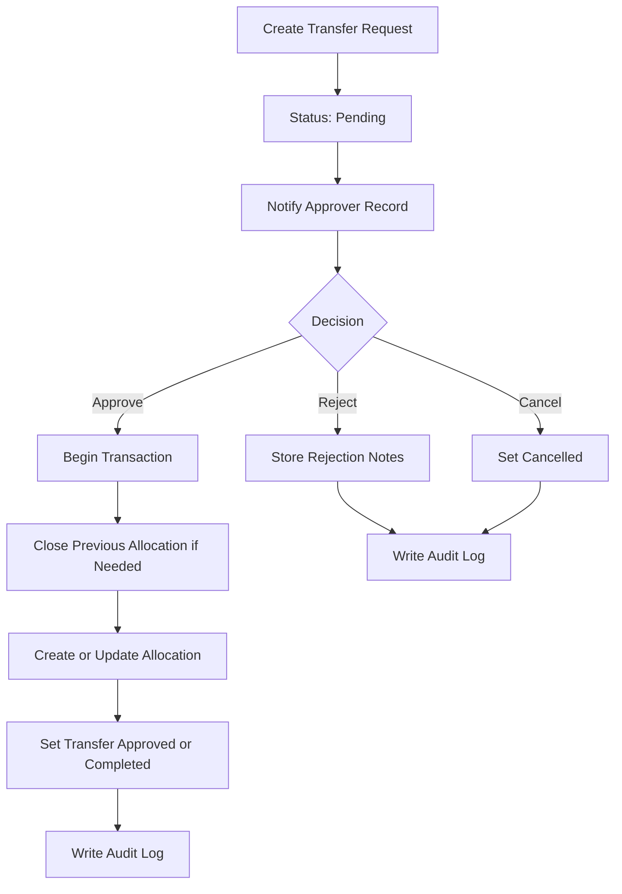
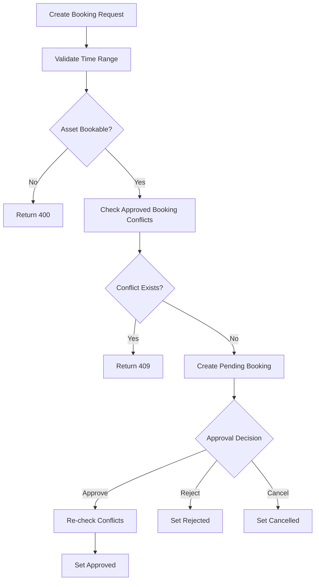
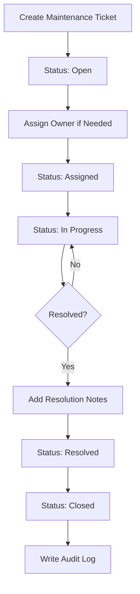
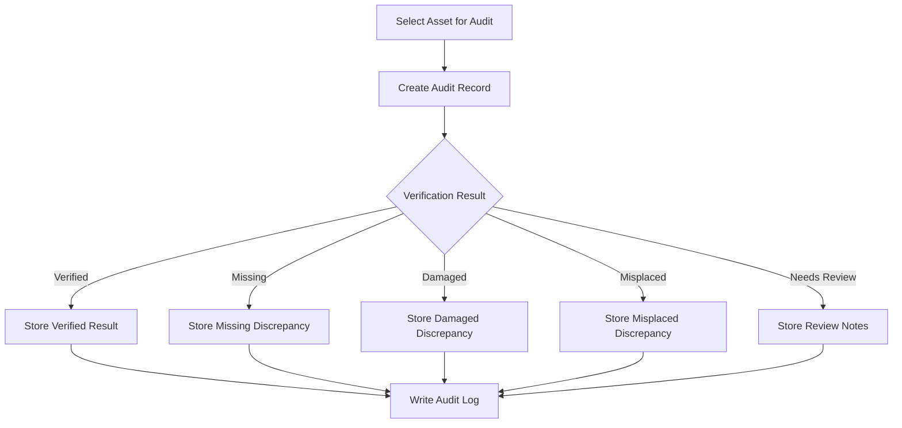

# Backend Workflow Diagrams

## Table of Contents

- [Authentication Workflow](#authentication-workflow)
- [Asset Lifecycle Workflow](#asset-lifecycle-workflow)
- [Transfer Workflow](#transfer-workflow)
- [Booking Workflow](#booking-workflow)
- [Maintenance Workflow](#maintenance-workflow)
- [Audit Workflow](#audit-workflow)

## Authentication Workflow

## Asset Lifecycle Workflow

## Transfer Workflow

## Booking Workflow

## Maintenance Workflow

## Audit Workflow

