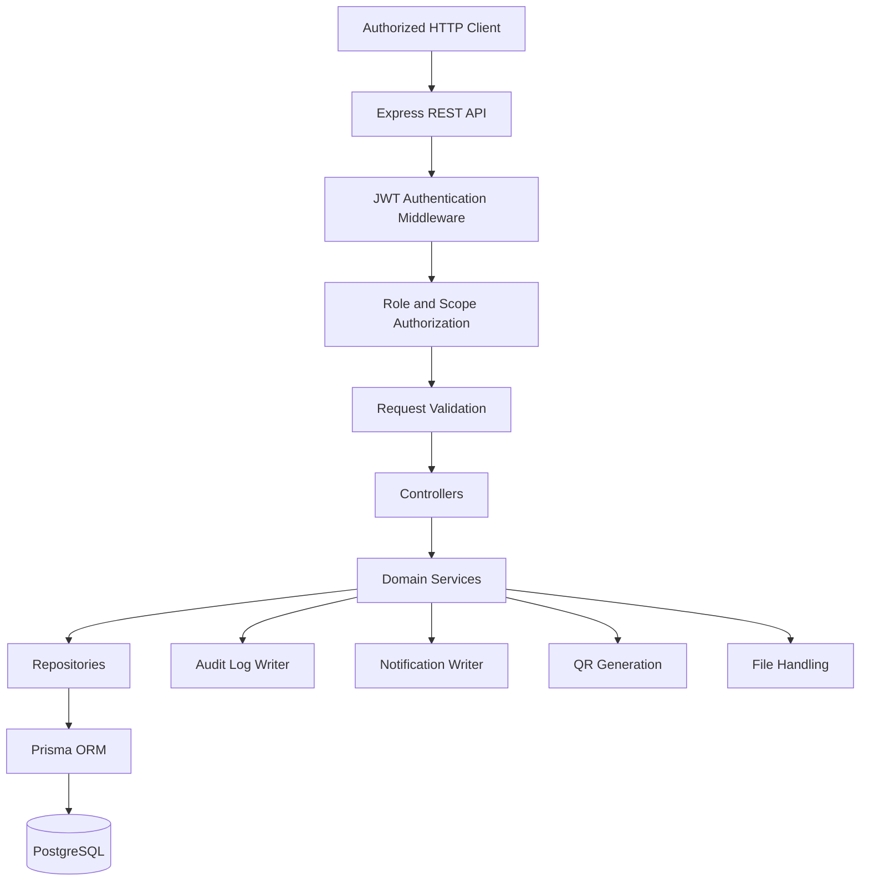
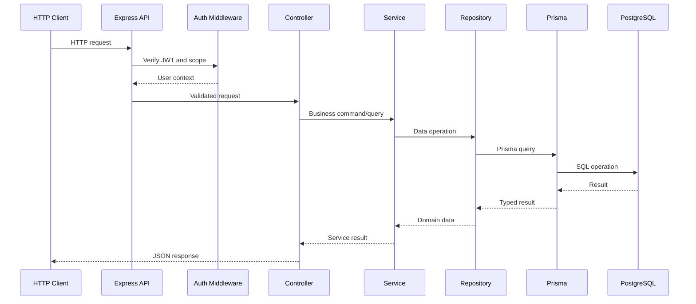
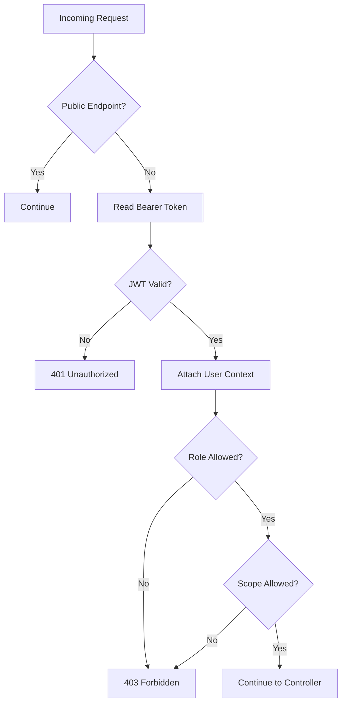

# Backend System Architecture

## Table of Contents

- [Architecture Summary](#architecture-summary)
- [High-Level Architecture](#high-level-architecture)
- [Request Lifecycle](#request-lifecycle)
- [Backend Layers](#backend-layers)
- [Authentication and Authorization](#authentication-and-authorization)
- [Data Persistence](#data-persistence)
- [Transactions](#transactions)
- [Cross-Cutting Concerns](#cross-cutting-concerns)
- [Architecture Decisions](#architecture-decisions)

## Architecture Summary

AssetFlow backend follows a layered REST API architecture:

```text
Authorized HTTP Client
  -> Express REST API
  -> Middleware
  -> Controllers
  -> Services
  -> Repositories
  -> Prisma ORM
  -> PostgreSQL
```

The backend owns authentication, authorization, request validation, business rules, persistence, audit logging, file handling, QR generation, and deployment behavior.

## High-Level Architecture



## Request Lifecycle



## Backend Layers

| Layer | Responsibility |
| --- | --- |
| `routes/` | Define endpoint paths and attach middleware. |
| `middleware/` | Authentication, authorization, validation, upload handling, error handling. |
| `controllers/` | Translate HTTP requests into service calls and response shapes. |
| `services/` | Own business workflows, lifecycle state changes, and transaction boundaries. |
| `repositories/` | Encapsulate Prisma queries and persistence details. |
| `validators/` | Define request payload and query validation rules. |
| `utils/` | Shared helpers for tokens, password hashing, QR generation, dates, and responses. |
| `types/` | Shared backend TypeScript types. |
| `prisma/` | Prisma schema, migrations, and seed entry points. |

## Authentication and Authorization



Security standards:

- Store only bcrypt password hashes.
- Keep JWT secret in environment variables.
- Never return password hashes.
- Use role checks and scope checks together.
- Log sensitive lifecycle changes.

## Data Persistence

AssetFlow uses PostgreSQL for relational integrity and Prisma for typed database access.

| Concern | Standard |
| --- | --- |
| Relationships | Enforce with foreign keys. |
| Current State | Store on primary entities such as `assets.status`. |
| History | Store in lifecycle tables such as allocations, transfers, maintenance, and audit records. |
| Logs | Store append-only audit events where practical. |
| Reports | Build from normalized tables with indexes. |

## Transactions

Use database transactions for operations that must update multiple records atomically.

Examples:

- Allocate asset and update asset status.
- Approve transfer, close previous allocation, create new allocation, write audit log.
- Approve booking after conflict re-check.
- Close maintenance ticket and restore asset status.

## Cross-Cutting Concerns

| Concern | Backend Standard |
| --- | --- |
| Errors | Use consistent error response with code, message, and optional details. |
| Validation | Validate body, params, and query before service logic. |
| Pagination | Apply to large list endpoints. |
| Filtering | Support common fields such as status, department, category, date range. |
| Audit Logs | Store actor, action, entity type, entity id, metadata, timestamp. |
| Time | Store timestamps in UTC. |
| Uploads | Validate file type and size before storage. |
| Secrets | Use environment variables; never commit real secrets. |

## Architecture Decisions

| Decision | Reason |
| --- | --- |
| REST API | Simple, testable with Postman, suitable for hackathon and backend ownership. |
| Express.js | Lightweight and familiar for Node.js APIs. |
| TypeScript | Improves maintainability and API contract clarity. |
| Prisma ORM | Typed database access and reliable migration workflow. |
| PostgreSQL | Strong relational integrity and transaction support. |
| JWT | Straightforward stateless authentication for protected APIs. |

