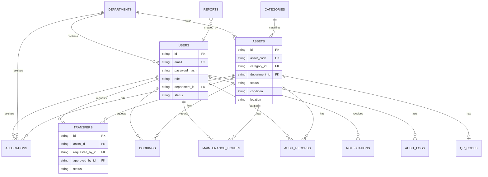

# Database Design

## Table of Contents

- [Database Goals](#database-goals)
- [Normalization](#normalization)
- [Entity Relationship Diagram](#entity-relationship-diagram)
- [Core Tables](#core-tables)
- [Relationships](#relationships)
- [Foreign Keys](#foreign-keys)
- [Indexes](#indexes)
- [Transactions](#transactions)
- [Soft Deletes](#soft-deletes)
- [Migration Strategy](#migration-strategy)
- [Prisma Workflow](#prisma-workflow)
- [Seeding Strategy](#seeding-strategy)
- [Naming Standards](#naming-standards)
- [Database Folder Purpose](#database-folder-purpose)

## Database Goals

AssetFlow uses PostgreSQL as the source of truth for asset lifecycle data. The database must preserve current state, historical activity, authorization scope, and reportable records.

Goals:

- Maintain normalized records for assets, users, departments, workflows, and logs.
- Enforce referential integrity with foreign keys.
- Use transactions for multi-record lifecycle changes.
- Preserve history for allocations, transfers, bookings, maintenance, and audits.
- Support efficient filtering through indexes.
- Use migrations for repeatable schema changes.

## Normalization

Recommended normalization approach:

| Principle | Application |
| --- | --- |
| First normal form | Store atomic values; avoid comma-separated lists. |
| Second normal form | Keep workflow records dependent on their own primary keys. |
| Third normal form | Store departments, categories, and users separately instead of duplicating names. |
| Controlled denormalization | Store current asset status on `assets` for fast lookup while preserving history in lifecycle tables. |

## Entity Relationship Diagram



## Core Tables

| Table | Purpose |
| --- | --- |
| `users` | Stores account, role, department, and active state. |
| `departments` | Stores organization units and optional manager relationship. |
| `categories` | Stores asset classification metadata. |
| `assets` | Stores current asset identity and state. |
| `allocations` | Stores assignment history for assets. |
| `transfers` | Stores transfer requests and decisions. |
| `bookings` | Stores shared asset reservations. |
| `maintenance_tickets` | Stores service and repair lifecycle. |
| `audit_records` | Stores asset verification outcomes. |
| `audit_logs` | Stores append-only system activity records. |
| `notifications` | Stores user lifecycle notifications. |
| `reports` | Stores generated report metadata when needed. |
| `qr_codes` | Stores QR values or generated image references. |

## Relationships

| Relationship | Cardinality | Notes |
| --- | --- | --- |
| Department to users | One-to-many | A user may belong to one department. |
| Department to assets | One-to-many | Assets can be owned by departments. |
| Category to assets | One-to-many | Each asset belongs to one category. |
| Asset to allocations | One-to-many | Assignment history must be preserved. |
| Asset to transfers | One-to-many | Transfer history must be preserved. |
| Asset to bookings | One-to-many | Shared assets may have many reservations. |
| Asset to maintenance tickets | One-to-many | Service history must be preserved. |
| Asset to audit records | One-to-many | Assets can be verified multiple times. |
| Asset to QR code | One-to-one | One active QR identity per asset. |
| User to notifications | One-to-many | Notifications are recipient-specific. |

## Foreign Keys

| Table | Foreign Keys |
| --- | --- |
| `users` | `department_id -> departments.id` |
| `departments` | `manager_id -> users.id` |
| `assets` | `category_id -> categories.id`, `department_id -> departments.id` |
| `allocations` | `asset_id -> assets.id`, `user_id -> users.id`, `department_id -> departments.id`, `assigned_by_id -> users.id` |
| `transfers` | `asset_id -> assets.id`, requester/approver/source/destination user and department keys |
| `bookings` | `asset_id -> assets.id`, `requested_by_id -> users.id`, `approved_by_id -> users.id` |
| `maintenance_tickets` | `asset_id -> assets.id`, `reported_by_id -> users.id`, `assigned_to_id -> users.id` |
| `audit_records` | `asset_id -> assets.id`, `auditor_id -> users.id` |
| `audit_logs` | `actor_id -> users.id` where available |
| `notifications` | `user_id -> users.id` |
| `reports` | `created_by_id -> users.id` |
| `qr_codes` | `asset_id -> assets.id` |

## Indexes

| Table | Recommended Index | Reason |
| --- | --- | --- |
| `users` | unique `email` | Login lookup. |
| `users` | `role`, `department_id`, `status` | Authorization and administration filters. |
| `departments` | unique `code` | Stable department reference. |
| `categories` | unique `code` | Stable category reference. |
| `assets` | unique `asset_code` | Fast asset lookup. |
| `assets` | `status`, `department_id`, `category_id` | Inventory filters. |
| `allocations` | `asset_id`, `status` | Current allocation lookup. |
| `allocations` | `user_id`, `status` | Assigned asset lookup. |
| `transfers` | `status`, `requested_by_id`, `asset_id` | Approval queues and history. |
| `bookings` | `asset_id`, `start_time`, `end_time`, `status` | Conflict detection. |
| `maintenance_tickets` | `asset_id`, `status`, `priority` | Maintenance dashboards and queues. |
| `audit_records` | `asset_id`, `audited_at`, `result` | Audit history and discrepancy reports. |
| `audit_logs` | `entity_type`, `entity_id`, `created_at` | Entity timelines. |
| `notifications` | `user_id`, `is_read`, `created_at` | Notification inbox and unread count. |

## Transactions

Use transactions when a workflow changes more than one table.

| Workflow | Transaction Operations |
| --- | --- |
| Allocation | Create allocation, update asset status, write audit log. |
| Transfer approval | Close old allocation, create new allocation, update transfer, update asset, write audit log. |
| Booking approval | Re-check conflicts, update booking status, create notification. |
| Maintenance closure | Update ticket, update asset status, write audit log. |
| Asset retirement | Validate no active conflicts, update asset, close related records if required, write audit log. |

## Soft Deletes

Recommended approach:

- Users: use `status = INACTIVE`.
- Departments: use `status = INACTIVE`.
- Assets: use `status = RETIRED`, `LOST`, or `ARCHIVED`.
- Categories: prevent deletion if assets reference them; use inactive state if needed.
- Audit logs: never delete during normal operations.

## Migration Strategy

- Every schema change must be represented by a Prisma migration.
- Migration names should describe intent, such as `add_asset_bookings`.
- Avoid editing already-applied migrations in shared environments.
- Review destructive changes carefully.
- Keep seed data compatible with the latest schema.
- Run migrations locally before opening a pull request.

## Prisma Workflow

```text
Edit prisma/schema.prisma
  -> run npx prisma format
  -> run npx prisma migrate dev --name <change-name>
  -> run npx prisma generate
  -> update seed data if required
  -> update database documentation
  -> test affected APIs
```

## Seeding Strategy

Seed data should support local development and demos.

Recommended seed records:

- Admin, Manager, Employee, and Auditor users.
- Three departments.
- Five asset categories.
- Ten realistic assets.
- Initial allocations.
- Example transfer, booking, maintenance, audit, and notification records.

## Naming Standards

| Item | Standard | Example |
| --- | --- | --- |
| Table names | plural snake_case | `maintenance_tickets` |
| Columns | snake_case | `asset_code` |
| Primary keys | `id` | `id` |
| Foreign keys | `<entity>_id` | `asset_id` |
| Timestamps | `created_at`, `updated_at` | `created_at` |
| Enums | clear uppercase values | `PENDING`, `APPROVED` |
| Migration names | action-based snake_case | `add_booking_conflict_indexes` |

## Database Folder Purpose

Detailed database operating guides live in `Database/`:

| File | Purpose |
| --- | --- |
| `Database/README.md` | Database folder overview and workflow. |
| `Database/schema.md` | Schema documentation and table responsibilities. |
| `Database/seed.md` | Seed data standards. |
| `Database/migration-guide.md` | Migration process. |
| `Database/naming-conventions.md` | Naming rules. |
| `Database/backup-guide.md` | Backup and restore process. |
| `Database/postgres-setup.md` | PostgreSQL local setup. |
